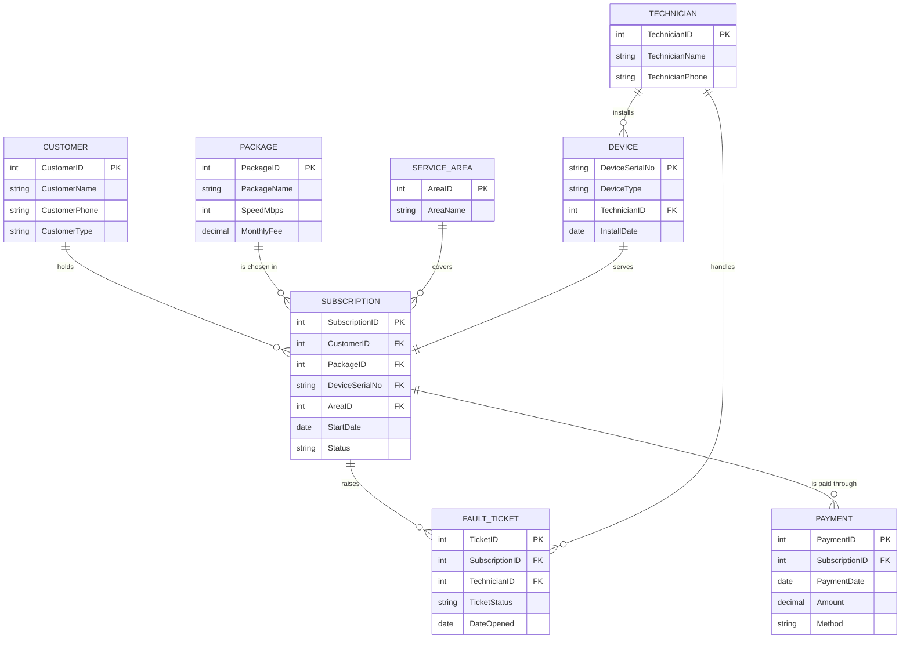

```mermaid
erDiagram
    CUSTOMER ||--o{ SUBSCRIPTION : holds
    PACKAGE ||--o{ SUBSCRIPTION : "is chosen in"
    SERVICE_AREA ||--o{ SUBSCRIPTION : covers
    DEVICE ||--|| SUBSCRIPTION : serves
    SUBSCRIPTION ||--o{ PAYMENT : "is paid through"
    SUBSCRIPTION ||--o{ FAULT_TICKET : raises
    TECHNICIAN ||--o{ FAULT_TICKET : handles
    TECHNICIAN ||--o{ DEVICE : installs

    CUSTOMER {
        int CustomerID PK
        string CustomerName
        string CustomerPhone
        string CustomerType
    }

    PACKAGE {
        int PackageID PK
        string PackageName
        int SpeedMbps
        decimal MonthlyFee
    }

    SERVICE_AREA {
        int AreaID PK
        string AreaName
    }

    DEVICE {
        string DeviceSerialNo PK
        string DeviceType
        int TechnicianID FK
        date InstallDate
    }

    SUBSCRIPTION {
        int SubscriptionID PK
        int CustomerID FK
        int PackageID FK
        string DeviceSerialNo FK
        int AreaID FK
        date StartDate
        string Status
    }

    PAYMENT {
        int PaymentID PK
        int SubscriptionID FK
        date PaymentDate
        decimal Amount
        string Method
    }

    FAULT_TICKET {
        int TicketID PK
        int SubscriptionID FK
        int TechnicianID FK
        string TicketStatus
        date DateOpened
    }

    TECHNICIAN {
        int TechnicianID PK
        string TechnicianName
        string TechnicianPhone
    }
```
